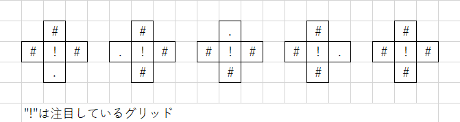
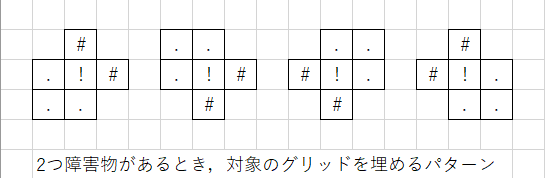

# buryDeadendAlgo
格子世界において袋小路を埋めるアルゴリズム

## 背景
大学の講義で鬼ごっこをするエージェントを作成する課題があった．逃げる側(追いかける側は「鬼」だけど逃げる側の名前ってなんだろう)のエージェントを作る際にそれなりに有用だと感じるアルゴリズムを考えたのだが，返却されたレポートにそのアルゴリズムの解説がわからないと書かれていて悔しかったのでこの場でリベンジする．

## 前提知識
詳しくは[講義ページ](https://www.fun.ac.jp/~osawa/course/DCS/lab/1/index.html "DCS Labolatory 1")を見ていただくとして，鬼ごっこのルールや用語について軽く解説する．この鬼ごっこは正確には二人追跡ゲーム(2 player pursuit game)と呼ばれ，鬼は捕食者(predator)，逃げる側は獲物(prey)と呼ばれる．捕食者と獲物が2次元の格子世界上で追う・逃げるを行う．講義では8x8の格子世界が用いられた．ターン性でゲームが進行し，各エージェントは上，下，右，左の4つから行動を選択する．格子世界には障害物が存在し，それを認識して行動を選択することが求められる．何もない格子(グリッド
)は自由格子(free grid)と呼ばれる．

出力や図で用いる記号表現は以下のようである
- 獲物: "*"
- 捕食者: "@"
- 障害物: "#"
- 自由格子: "."

## アルゴリズムの概要
獲物が逃げる際，袋小路に逃げ込むのは一番避けたい事である．このアルゴリズムは袋小路となっている部分を埋める(自由格子を障害物にする)処理を行う．この処理によって獲物は袋小路に入りこまなくなる．埋めるのは障害物によってのみ形成される袋小路のみであり，格子世界の端(境界)は袋小路を形成する要素として判断しない．

## 具体的な処理
自由格子であるグリッドの1つに注目してそのグリッドを条件によって埋める処理を，格子世界全体に適用させることで袋小路を埋める処理を実現している．あるグリッドに対する上下左右のグリッドを4方向近傍のグリッドと呼ぶことにする．

4方向近傍のグリッドのうち，3つ以上が障害物であれば明らかにそのグリッドは袋小路であり，そこは埋めても問題ないので埋める処理を行う．この条件に当てはまるような状態は5パターン存在する．



4方向近傍のグリッドのうち，2つが障害物であるとき，そのグリッドを埋めることで通がふさがらない場合のみグリッドを埋める処理を行う．2つの障害物が注目しているグリッドの上下もしくは左右に存在している場合，そのグリッドを埋めることで通がふさがるのは明らかである．それ以外の場合，例えば上と右が障害物の時，左下が障害物であったらそのグリッドを埋めることで道がふさがってしまう．これは右と下が障害物の時に左上，下と左が障害物の時右上，左と上が障害物の時右下が障害物のとき同じことが言える．



以上のような処理を格子世界の各グリッドに適用させ，もし対象のグリッドが埋められたならば，その変更を伝播させていくためにグリッドの4方向近傍の全てのグリッドに同じ処理を適用させる．

## 特徴[WIP]
このアルゴリズムが優れていると考える点をいくつか紹介する
### 獲物が閉じ込められることがない

### 袋小路を完全に埋めないパターンがある

## プログラムの説明
このプログラムはC言語にて作成されている．普通にコンパイルして実行すれば動く(そこらへん詳しくない．筆者はgcc使った)．

コマンドライン引数でファイル名を変更することで任意の格子世界にこのアルゴリズムを適用させることができる．初期設定は`battlefield.dat`である．たとえば`battlefield1.dat`に適用させたい場合，
```
$ ./buryDeadend.out battlefield1.dat
```
で実現できる．格子世界のファイルは64行で各行に1つの値，自由格子は`0`，障害物は`-1`，捕食者は`1`，獲物`10`で表せられることに注意する．これを満たさない場合エラーが返される．エラー処理はちゃんとやったつもりだけど自信はない．

このプログラムを実行すると以下のように，もともとの格子世界と袋小路を埋めた格子世界をそれぞれ出力する．


## このアルゴリズムの限界・欠点[WIP]
- どこまでを袋小路として定義するか(格子世界そのものが袋小路)
- プログラム自体が場合分けで書かれていてもっといいやり方ありそう
## 本題とは関係ないけど[WIP]
エラー処理ちゃんとやろうね．配列は添え字を返す関数を挟めば安心．それをしなかったので自分は本番でエラー吐いて顔面蒼白した．

## 最後に[WIP]
このアイディアを使ってもらうのは願ったりかなったりだけどコピーはやめようね．私も怒られたくないし．改善点(特にプログラムの部分)とか意見は是非欲しい．まだ解説がわかりにくい気がする．特に[具体的な処理](#具体的な処理)の部分．全パターンを列挙する力技を使えば確実だけどもっと効率的な解説を求めたい．参考までに，筆者はこのアルゴリズムと，捕食者からの実際の距離と直線距離の差が一番大きくなるグリッドを目指して逃げるみたいな戦略を考えた．結局エラー落ちで結果が出なかったのでこれが有用かどうかは不明．