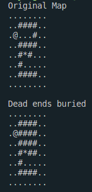

# buryDeadendAlgo
格子世界において袋小路を埋めるアルゴリズム

## 背景
大学の講義で鬼ごっこをするエージェントを作成する課題があった．逃げる側(追いかける側は「鬼」だけど逃げる側の名前ってなんだろう)のエージェントを作る際にそれなりに有用だと感じるアルゴリズムを考えたのだが，返却されたレポートにそのアルゴリズムの解説がわからないと書かれていて悔しかったのでこの場でリベンジする．

## 前提知識
詳しくは[講義ページ](https://www.fun.ac.jp/~osawa/course/DCS/lab/1/index.html "DCS Labolatory 1")を見ていただくとして，鬼ごっこのルールや用語について軽く解説する．この鬼ごっこは正確には二人追跡ゲーム(2 player pursuit game)と呼ばれ，鬼は捕食者(predator)，逃げる側は獲物(prey)と呼ばれる．捕食者と獲物が2次元の格子世界上で追う・逃げるを行う．講義では8x8の格子世界が用いられた．ターン性でゲームが進行し，各エージェントは上，下，右，左の4つから行動を選択する．格子世界には障害物が存在し，それを認識して行動を選択することが求められる．何もない格子(グリッド
)は自由格子(free grid)と呼ばれる．

## アルゴリズムの概要
獲物が逃げる際，袋小路に逃げ込むのは一番避けたい事である．このアルゴリズムは袋小路となっている部分を埋める(自由格子を障害物にする)処理を行う．この処理によって獲物は袋小路に入りこまなくなる．埋めるのは障害物によってのみ形成される袋小路のみである．格子世界の端(境界)は袋小路を形成する要素として判断しない

## 具体的な処理[WIP]
一つのグリッドに注目してそのグリッドを条件によって埋める処理を，格子世界全体に適用させることで袋小路を埋める処理を実現している．

## 特徴[WIP]
- コの字の中に障害物がある場合，それらを壁として1本の通ができる．

## プログラムの説明[WIP]
コマンドライン引数でファイル名変更
もともとの格子世界と，袋小路を埋めた格子世界を出力

プログラムの動作イメージ
## このアルゴリズムの限界・欠点[WIP]
- どこまでを袋小路として定義するか(格子世界そのものが袋小路)
- プログラム自体が場合分けで書かれていてもっといいやり方ありそう
## 本題とは関係ないけど[WIP]
エラー処理ちゃんとやろうね．配列は添え字を返す関数を挟めば安心．それをしなかったので自分は本番でエラー吐いて顔面蒼白した．

## 最後に[WIP]
このアイディアを使ってもらうのは願ったりかなったりだけどコピーはやめようね．私も怒られたくないし．改善点(特にプログラムの部分)とか意見は是非欲しい．